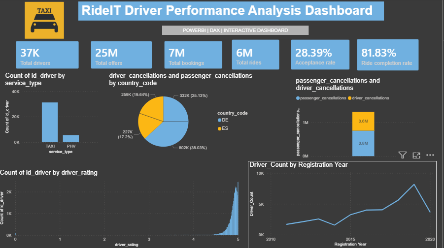

# RIDEIT-DASHBOARD
# RideIT Driver Performance Analysis Dashboard

## Project Overview
This Power BI dashboard analyzes RideIT driver performance, ride activity, bookings, cancellations, service type, and driver registration trends.

## Dashboard Preview
-(https://github.com/shriyavogilishetty/RIDEIT-DASHBOARD/blob/main/snapshot_dashboard.png.png)

## Key KPIs
- Total Drivers: 37K
- Total Offers: 25M
- Total Bookings: 7M
- Total Rides: 6M
- Acceptance Rate: 28.39%
- Ride Completion Rate: 81.83%

## Tools Used
- Power BI
- Power Query
- DAX
- Data Modeling
- GitHub

## Dashboard Features
- KPI cards for overall business performance
- Service type comparison: TAXI vs PHV
- Driver rating distribution
- Cancellation analysis by country
- Passenger vs driver cancellation comparison
- Driver registration year trend

## Project Files
- `project_rideit.pbix` - Power BI dashboard file
- `snapshot_dashboard.png.png` - Dashboard image
- `README.md` - Project documentation

## Key Insights
- Total drivers are around 37K.
- Total offers reached 25M.
- Total bookings are around 7M.
- Total completed rides are around 6M.
- Ride completion rate is 81.83%.
- Acceptance rate is 28.39%.
- Most driver ratings are concentrated near 5.
- TAXI service has more drivers compared to PHV.

## Created By
**Shriya Vogilishetty**
